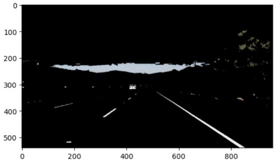
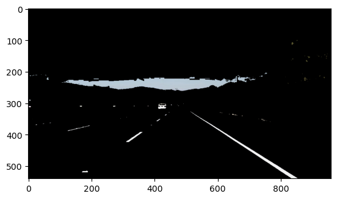

# **Finding Lane Lines on the Road** 

The goals / steps of this project are the following:
* Make a pipeline that finds lane lines on the road
* Reflect on your work in a written report

[//]: # (Image References)

[image1]: ./examples/grayscale.jpg "Grayscale"

---

### Reflection

### 1. Describe your pipeline. As part of the description, explain how you modified the draw_lines() function.

The pipeline basically follows the given steps from the introduction tutorial.
1. Takes the raw image and transform it to HSV to prepare for colour thresholding.
2. Colour threshold based on hue and saturation found using histograms.
3. Convert the resulting image to greyscale and smooth it to prepare for canny edge detection.
4. Perform Canny edge detection with parameters that are found based on trial-and-error.
5. Filter off non-lane marking regions by providing the four vertices of a trapezoid. Again, the vertices are determined based on visual approximation from output images. The four vertices' x-values are labeled X1, X2, X3, and X4 from left to right.
6. Run Hough line detection on the filtered image. Here, the default helper had to be modified to also return the list of lines so they can be converted to points for RANSAC.
7. Separate the points from the previous step into right and left lane markings.
8. Run RANSAC on the list of points by picking at a minimum 2 points at a time to train up until a maximum of 500 training cycles.
9. The final lane markings are drawn between points whose x-values corresponded to the region of interest trapezoid's x-values. The corresponding y-values are the RANSAC model's prediction for each x-value.

I didn't directly change the draw_lines() function, I simply wrote another function that categorized lines into left and right using the following logic:
1. Get the x-value for the half way point in the region of interest.
2. Get the (x, y) coordinates of the start and end of the line as provided by previous Hough line detection.
3. If the line is vertical (x1 == x2), then compare the x value with the half way point to determine if it is to the left or right.
4. Calculate the slope of the line using the standard slope calculation.
5. If the slope if positive, it's sloping from top left to bottom right, which is likely the right lane.
6. If the slope if negative, it's sloping from bottom left to top right, which is likely the left lane.
7. If the line is horizontal, then do the same as the vertical lines, but only compare the starting point with the half way point (since the x-values actually change for horizontal lines).

### 2. Identify potential shortcomings with your current pipeline

1. The colour masking is predefined to search for a range of qualifying colours. If cars, signs or foliage are a similar colour (and some are in the examples), they will also be left after the masking.

2. The region of interest masking is also predefined, which can include artifacts from items other than lane markings.

When the above issues are combined, we can foresee when a white or yellow car is really close to the ego vehicle, it can cause lane markings to fuse into a blob. In this scenario, there will be lines outlining the area of the car, which will skew the RANSAC algorithm, causing the final lanes to be drawn skewed to the centre of the lane.

3. The left-right line separation algorithm doesn't always categorize them correctly. Noticeably, some lines from either lane can have the "wrong" slope because of the perspective. This is especially true for the short horizontal lines on the ends of each marking.

#### 2.1 Example of the colour masking issue

For example, with a lower yellow saturation, there are noticeably more trees and grass from the right side compared to a higher yellow saturation as shown below.

### 3. Suggest possible improvements to your pipeline

If left and right lines are separated only using the centre x-value of the region of interest, it will not have the problem described in point 3 in the previous section.

The masking issues can be prevented by adding more advanced algorithms designed to identify larger structures such as cars and signs.
